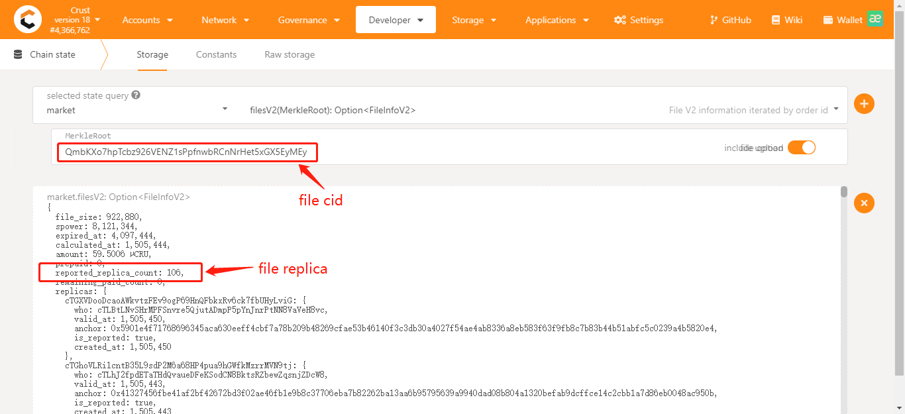

# Elrond Storage Smart Contract on Crust Network

Elrond storage smart contract aims to store user data on Crust Network, simple and cheap.

## Crust Network

Crust provides a decentralized storage network of Web3 ecosystem. It supports multiple storage layer protocols such as IPFS, and exposes storage interfaces to application layer. It is designed to build a decentralized cloud ecosystem that values data privacy and ownership. For more information about Crust Network, please refer to [this link](https://wiki.crust.network).

## Elrond Storage Smart Contract

Elrond storage smart contract provides Elrond users a simple and cheap way to store data on Crust Network. It indicates payment tokens and order nodes which help users to store data on Crust Network. Users just need to know file cid and size, then they can invoke storage smart contract to store data.

## Usage

### Add file to IPFS

Firstly, IPFS needs be installed. Refer to [IPFS installation](https://docs.ipfs.io/install).

Add file to IPFS with command:
```
// add file
ipfs add <path_to_file>

// add directory
ipfs add -r <path_to_directory>

// output for example
added QmXoQoCPvd9LyHsUtB2NAAM1fGJHY8Pq4bg9RxRNNUXHqg test.txt
 256 KB / 256 KB [=================================================================================] 100.00
```

A cid(IPFS file content id) will be obtained after complete(which is **QmXoQoCPvd9LyHsUtB2NAAM1fGJHY8Pq4bg9RxRNNUXHqg** in above example). Then use command as follows to get file size:
```
ipfs object stat <file_cid>

// output seems like:
NumLinks:       0
BlockSize:      262158
LinksSize:      4
DataSize:       262154
CumulativeSize: 262158
```
The **CumulativeSize** field indicates file size.

### Place order with Smart Contract

Use query **getPrice** to get file price. This query needs Elrond tokenIdentifier and file size as parameters. User can get the price in given token.
```
// erdpy tool
erdpy contract query <storage_contract_address> --function="getPrice" --arguments str:WEGLD-bd4d79 536870912 --proxy https://api.elrond.com

// output
[
    {
        "base64": "AAAAAAAAAAAFAJab3O8pbalpIIUcKihND42yJBm7VIM=",
        "hex": "00000000000000000500969bdcef296da96920851c2a284d0f8db22419bb5483",
        "number": 122655992726209858234059198096240245999702850689325290627
    },
    {
        "base64": "CiEsmlIF",
        "hex": "0a212c9a5205",
        "number": 11137598509573
    },
    {
        "base64": "CiEsmlIF",
        "hex": "0a212c9a5205",
        "number": 11137598509573
    }
]
```
Note: Given price cannot exceed the size upper limit, use ***getSizeLimit*** to query size upper limit. Given payment token may not be supported, use ***getSupportedTokens*** to check if it is supported before invoking ***placeOrder*** function.

The last item of output is the price for given size, for this example it is 11137598509573. If there is no output, please make sure the given token is supported by storage contract. Use "getSupportedTokens" function to get supported tokens.

After that, **placeOrder** function be used to place order with file cid and size as parameters.
```
// erdpy tool
erdpy contract call <storage_contract_address> --recall-nonce --pem="<path_to_wallet_pem>" --chain="1" --gas-limit="100000000" --function="placeOrder" --arguments str:QmRRAA8bSvQAm8ovK5YUudT1pjiFe2YB6gFKSSyU6GT54B 536870912 --send --value 11137598509573
```
Note: Given payment token may not be supported. Use ***getSupportedTokens*** to check if it is supported before invoking ***placeOrder*** function.

The example above uses EGLD as payment token. For other esdt tokens, please refer to [this link](https://docs.elrond.com/sdk-and-tools/erdjs/erdjs-cookbook/#transfer--execute).
The result can be checked on Elrond explorer.

Note: **DO NOT** shut down IPFS before the file has been confirmed to be stored on Crust Network.

### Check result on Crust Apps

After ordering successfully, the result can be checked on [Crust Apps](https://apps.crust.network), follow the picture below to check file replica.

